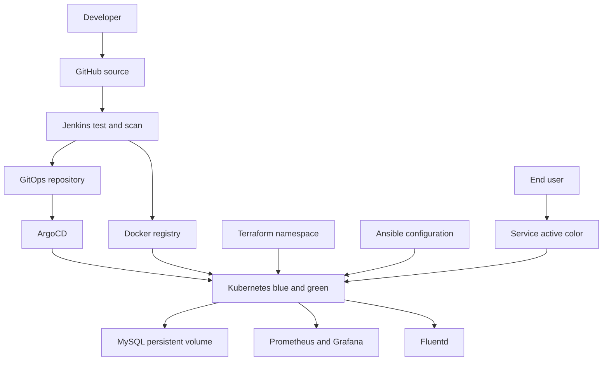

# Architecture

```mermaid
flowchart TD
 A[Developer] --> B[GitHub source]
 B --> C[Jenkins test and scan]
 C --> D[Docker registry]
 C --> E[GitOps repository]
 E --> F[ArgoCD]
 F --> G[Kubernetes blue and green]
 D --> G
 H[Terraform namespace] --> G
 I[Ansible configuration] --> G
 J[End user] --> K[Service active color]
 K --> G
 G --> L[MySQL persistent volume]
 G --> M[Prometheus and Grafana]
 G --> N[Fluentd]
```
